# 클라우데라 배포판을 이용한 하둡 및 빅데이터 오픈소스 설치하기

- 참고 : http://www.cloudera.com/downloads/manager/5-7-0.html
- CentOS 기준으로 준비함

## 설치전에 확인 사항
### 지원 운영체제 확인
- RHEL-compatible 
    - Red Hat Enterprise Linux and CentOS, 64-bit  : 
	    - 5.7, 5.10,  6.4,  6.5,  6.6,  6.7,  7.1,  7.2   
	- Oracle Enterprise Linux with default kernel and Unbreakable Enterprise Kernel, 64-bit
	    - 5.7, 5.10, 5.11, 6.4 (UEK R2), 6.5 (UEK R2, UEK R3), 6.6 (UEK R3), 6.7 (UEK R3), 7.1, 7.2
	- SLES - SUSE Linux Enterprise Server 11, Service Pack 4, 64-bit is supported by CDH 5.7 and higher. 
	- Debian - Wheezy 7.0, 7.1, and 7.8, 64-bit. (Squeeze 6.0 is only supported by CDH 4.)
	- Ubuntu - Trusty 14.04 (LTS) and Precise 12.04 (LTS), 64-bit. (Lucid 10.04 is only supported by CDH 4.)

### 지원되는 JDK 버전
- Oracle JDK 7u55
- Oracle JDK 6u31

### 지원되는 데이터베이스(UTF8 character set encoding 지원필요)
- MySQL , MariaDB , Oracle 11, Oracle 12, PostgreSQL 
	
### 요구되는 리소스
- 디스크 용량
    - Cloudera Manager Server( 관리서버 )
         - /var : 5 GB
         - /usr : 500 MB
	- Cloudera Management Service( 서비스서버 )
         - /var : 20 GB
- RAM : 4GB
- Python : CDH 5 requires Python 2.6 or 2.7
- 요구되는 네트워킹
	- ssh 통신 필요
	- Security-Enhanced Linux (SELinux) 설정 해제
	- 7180 포트 오픈


## 설치전 관리서버에서의 준비작업
- 모든 작업은 root 계정으로..
- 모든 서버의 root 패스워드는 동일하게 설정하는 것이 작업이 편리함. 필수는 아님.
- 클러스터를 구성하는 서버들의 도메인명을 등록
- DNS에 등록하는 것이 좋으나, 여건이 안 되면 /etc/hosts 에 등록함.
```
cat <<EOT >> /etc/hosts

192.168.xx.xx1  master01.mycompany.co.kr  master01  # master01이 관리서버라고 가정함.
192.168.xx.xx2  master02.mycompany.co.kr  master02

192.168.xx.x03  node01.mycompany.co.kr  node01
192.168.xx.x04  node02.mycompany.co.kr  node02
192.168.xx.x05  node03.mycompany.co.kr  node03
192.168.xx.x06  node04.mycompany.co.kr  node04
192.168.xx.x07  node05.mycompany.co.kr  node05
192.168.xx.x08  node06.mycompany.co.kr  node06
EOT
```

- 관리서버에서 ssh 로그인과정 없이 접속 가능하도록 설정
```
# ssh-keygen 입력후에 특별한 입력없이 엔터 3번
ssh-keygen

# 클러스터를 구성하는 모든 서버들에 대해서 아래와 같이 함
# 첫번째 입력 요구시 yes, 두번째 입력 요구시 해당서버의 root 패스워드 입력
ssh-copy-id -i  ~/.ssh/id_rsa.pub  master01
ssh-copy-id -i  ~/.ssh/id_rsa.pub  master02
ssh-copy-id -i  ~/.ssh/id_rsa.pub  node01
        ~
ssh-copy-id -i  ~/.ssh/id_rsa.pub  node06

# 관리서버의 ~/.ssh/의 파일들을 모든 서버들에 카피함.
# 아래 작업후에는 모든 서버들간에는 ssh을 로그인과정없이 접속이 가능함.
scp -r  ~/.ssh/  master01:~/.ssh/
     ~ 
scp -r  ~/.ssh/  node06:~/.ssh/
```
	
- 여러 서버에 동시에 명령어를 내리는 방법( PSSH 이용 )
```
# PSSH 설치
cd /usr/local/src
wget http://parallel-ssh.googlecode.com/files/pssh-2.1.1.tar.gz
tar xvf pssh-2.1.1.tar.gz
cd pssh-2.1.1
wget 'http://peak.telecommunity.com/dist/ez_setup.py'
python ez_setup.py
python setup.py install

# 홈디렉토리에 all_hosts.txt 와 hosts.txt 만들기
cat <<EOT >> ~/all_hosts.txt
# 관리서버를 포함함
master01
~
node06
EOT

cat <<EOT >>  ~/hosts.txt
# 관리서버를 포함하지 않음
master02
~
node06
EOT

# /etc/hosts 파일을 관리서버를 제외한 모든 서버에 카피
pscp -h ~/hosts.txt  /etc/hosts   /etc/hosts
```

	
## 설치전 준비 작업
- 모든 root 관련으로 하둡클러스터를 구성하는 모든 서버에 동일하게 적용함.
- 아래 명령어들은 pssh 이용해서 모든 서버에 명령을 내릴 수 있음

- Iptables 정지( 방화벽 정지 )
```
pssh -h ~/all_hosts.txt  service iptables stop
pssh -h ~/all_hosts.txt  chkconfig iptables off
```

- Selinux 정지
```
pssh -h ~/all_hosts.txt  'setenforce 0'
```

- swappiness 설정
```
pssh -h ~/all_hosts.txt  'sysctl –w vm.swappiness=0'
```

- transparent_hugepage 설정
```
pssh -h ~/all_hosts.txt   echo never > /sys/kernel/mm/transparent_hugepage/defrag
cat <<EOT >>  /etc/rc.local
echo never > /sys/kernel/mm/transparent_hugepage/defrag
EOT

pscp -h ~/hosts.txt /etc/rc.local  /etc/rc.local
```

- NTP 동기화
```
pssh -h ~/all_hosts.txt   yum install -y ntp
cat <<EOT >>  /etc/ntp.conf 
server 0.kr.pool.ntp.org
server 3.asia.pool.ntp.org
server 2.asia.pool.ntp.org
EOT

pscp -h ~/all_hosts.txt /etc/ntp.conf  /etc/ntp.conf 
pssh -h ~/all_hosts.txt   service ntpd stop
pssh -h ~/all_hosts.txt   ntpdate kr.pool.ntp.org
pssh -h ~/all_hosts.txt   service ntpd start
pssh -h ~/all_hosts.txt   chkconfig ntpd on
```

- file descriptor 수정
```
cat <<EOT >>   /etc/security/limits.conf
*    hard nofile 131072
*    soft nofile 131072
root hard nofile 131072
root soft nofile 131072
EOT

pscp -h ~/all_hosts.txt /etc/security/limits.conf  /etc/security/limits.conf
```

- 모든 서버 리부팅
```
pssh -h ~/all_hosts.txt  reboot
```

## Cloudera Manager 설치
- 관리서버에서만 root 계정으로
- 5 ~ 10분 정도 소요
```
wget http://archive.cloudera.com/cm5/installer/latest/cloudera-manager-installer.bin
chmod u+x cloudera-manager-installer.bin
./cloudera-manager-installer.bin
```


- 설치완료가 되면,  http://관리서버IP:7180 으로 브라우저로 접속하라고 함.
- 초기 admin ID의 패스워드는 admin 임.
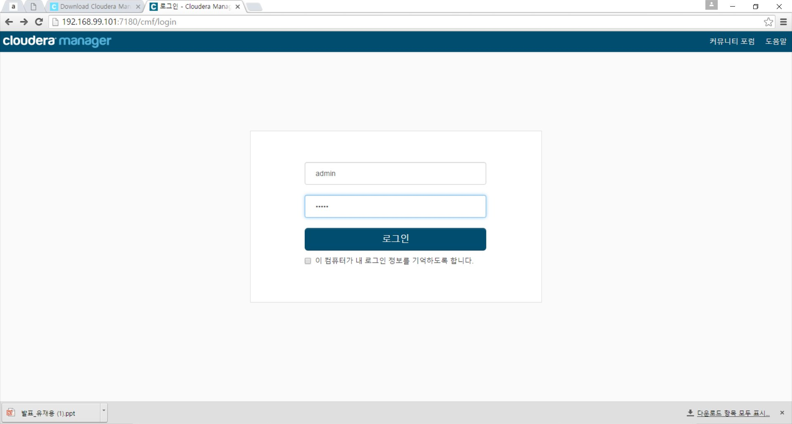

- 로그인후에 "최종 사용자 라이선스 사용 약관" 동의에 예를 선택하고 계속 버튼 클릭
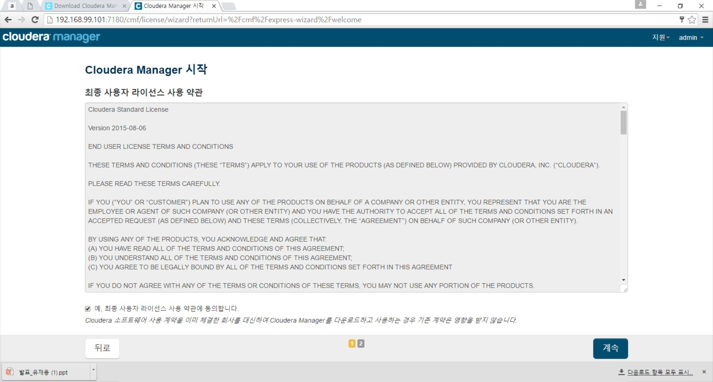

- "어떤 버전을 배포하시겠습니까?"에서는 Cloudera Express를 선택하고 계속 버튼 클릭
- Cloudera Enterprise 버전 라이선스를 구입하면, 기술지원 서비스를 받을 수 있음. 여러분이 고생할 필요가 없음. => 사 달라고 사장님에게 조르자~~
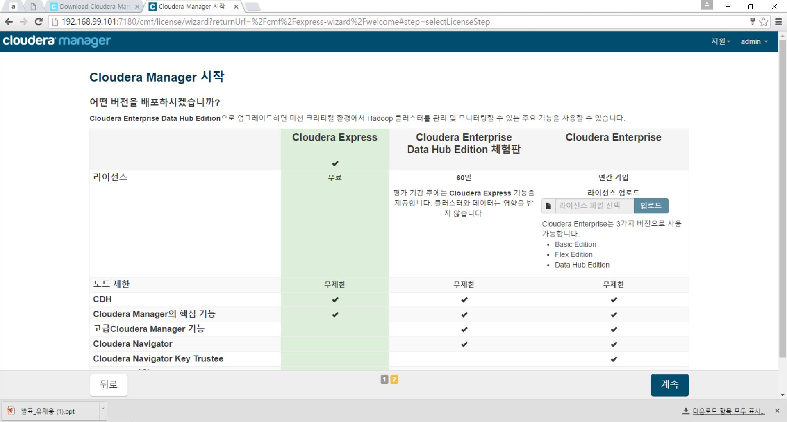

- Cloudera Express 에서 지원하는 오픈소스 목록만 나옴. 계속 버튼 클릭
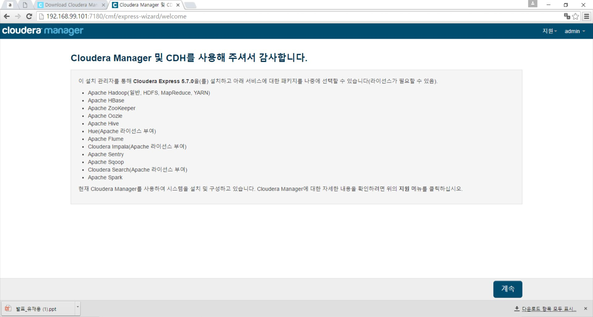

- 클러스터로 구성할 호스트명들을 모든 적어놓고, 검색버튼을 클릭함.
- 호스트명으로 SSH로 접속할 수 있는지 검사를 하고 결과를 보여줌.
- 모든 호스트가 잘 연결된다고 나오면 계속 버튼 클릭
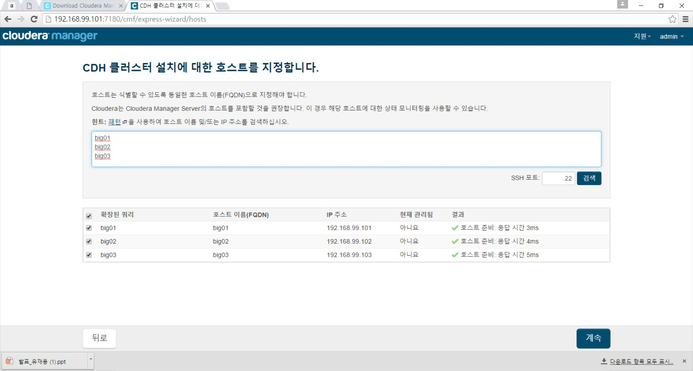

- 설치할 오픈소스와 패키지들의 저장소를 지정할 수 있음.
- 따로 만들지 않았으면, 아무것도 변경하지 않고 계속 버튼 클릭


- 오라클 자바의 사용권 계약 동의와 암호화 관련 자바 패키지를 설치여부임.
- 돈 나가는 일이 아니기 때문에 모두 선택하고  계속 버튼 클릭
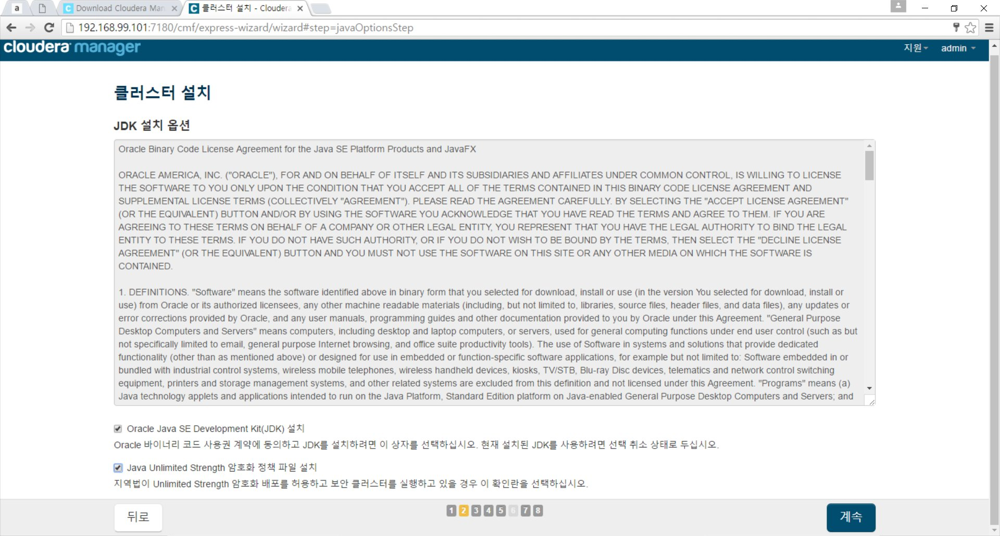

- 단일 사용자 모드 활성화 여부를 묻는 과정으로 특별한 이유가 없으면 선택하지 않고  계속 버튼 클릭
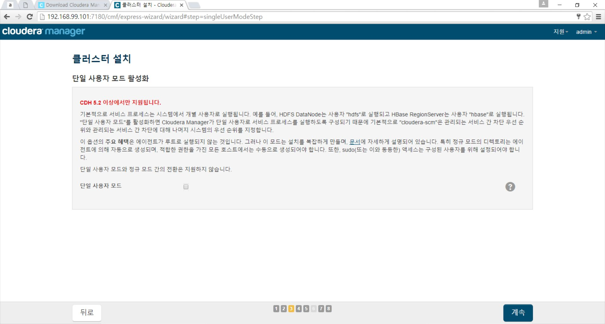

- 설치과정에 필요한 계정 정보를 입력하는 과정으로 root계정으로 하는 것이 편리함.
- 계정의 암호를 입력하거나 인증키를 사용할 수 있음.
- 잘 입력하고 계속 버튼 클릭


- 클러스터 설치 진행중 화면, 완료가 되면 계속버튼이 활성화됨. 10 ~ 30분 정도 걸림.
- 특정 호스트에서 오류가 생기거나 잘 시간 진행상태가 변화가 없으면 설치중단 시키고, 재시작 시킬 수 있음.
- 모든 설치가 완료되면 계속 버튼 클릭
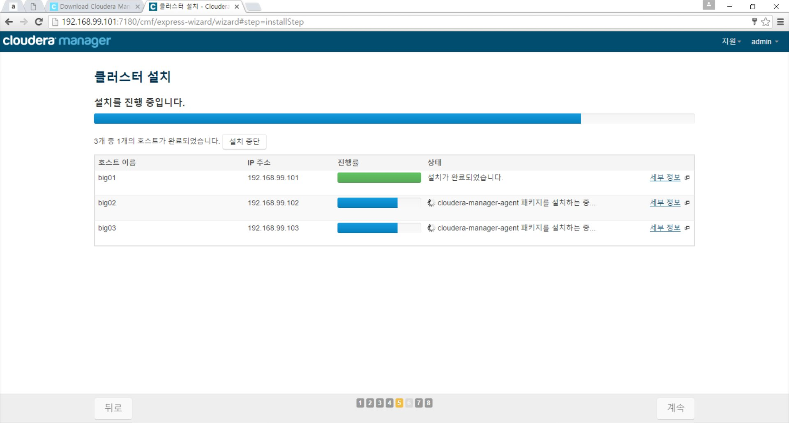

- 클라우데라 하둡을 설치중 화면, 완료가 되면  계속버튼이 활성화됨. 10분 정도 걸림.
- 모든 설치가 완료되면 계속 버튼 클릭
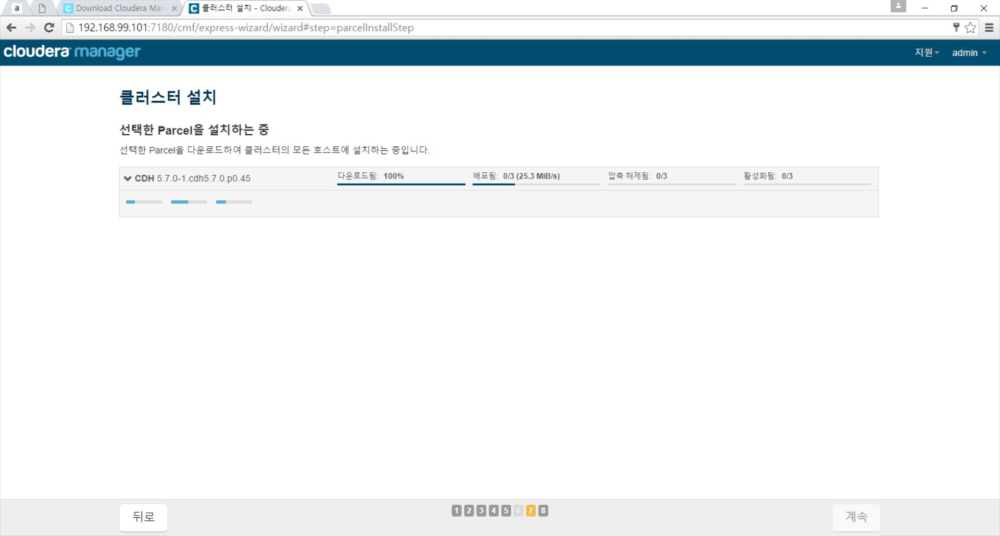

- 준비작업중에서 빼먹은것이 있으면 경고메시지가 나옴.
- 모든 호스트들에 대해서 안내 메시지와 같이 처리하고 "다시 실행"버튼을 클릭함
- 모든 검증에 문제가 없으면 완료 버튼 클릭
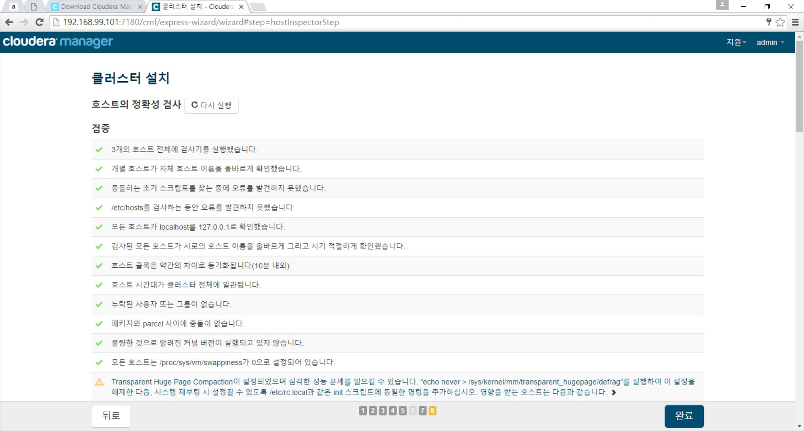


- 클러스터 설정으로 원하는 서비스 조합을 선택하거나 사용자 지정 서비스를 선택함.
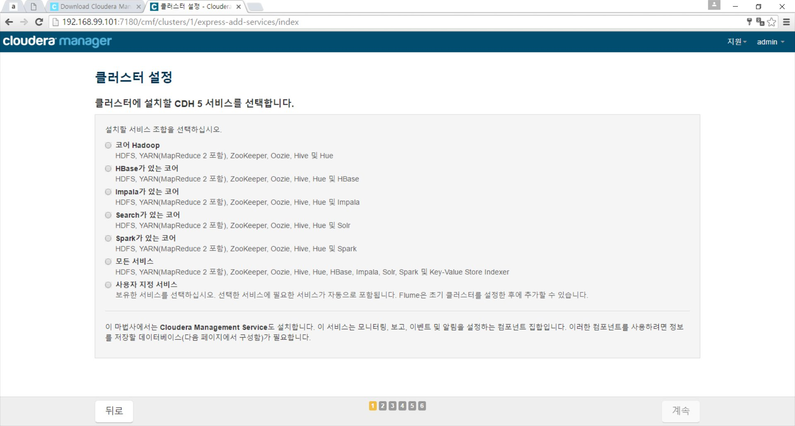

- 사용자 지정 서비스를 선택했을때의 화면. 잘 선택하고 계속 버튼 클릭
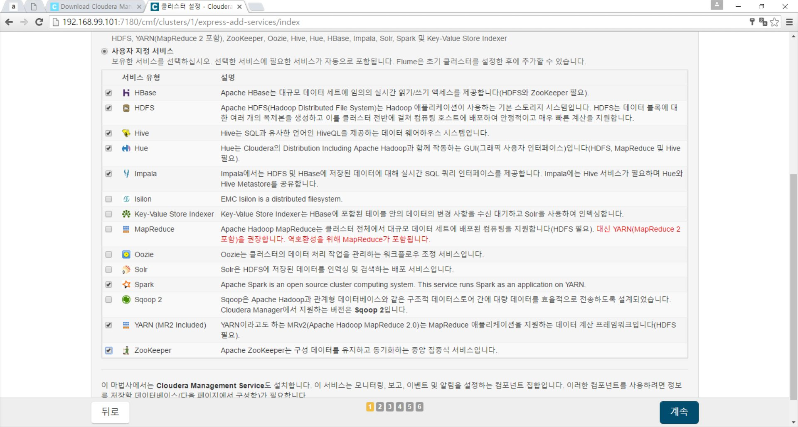

- 클러스터내의 호스트들의 역할 할당 지정하는 과정임.
- "호스트 선택"으로 된것은 아직 미지정이므로 역할이 고루 분포되도록 하고 다 하고 계속 버튼 클릭
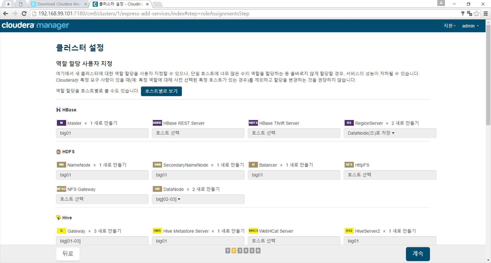

- 데이터베이스 설정으로 이전 과정에서 문제가 없었으면 변경없이 테스트 연결 버튼을 클릭함.
- "사용자 지정 데이터베이스 사용"을 선택하려면, 설치 가이드 링크를 참조함.
- 특별한 이유가 없으면, 그냥 내장된 데이터베이스 사용을 선택하고 계속 버튼 클릭
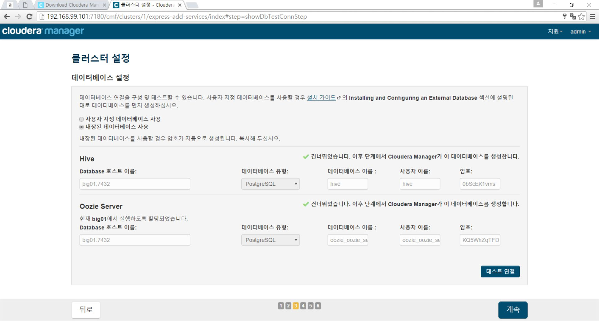

- 클러스터 설정 변경 내용 검토로 "DataNode 데이터 디렉토리"와 "NameNode 데이터 디렉토리"를 주의해서 결정이 필요함.
- "DataNode 데이터 디렉토리"에는 많은 데이터가 생성되는 곳으로 용량이 많은 디스크를 선택함.
- "NameNode 데이터 디렉토리"은 하둡의 파일 정보를 저장하는 곳으로 안정적인 스토리지로 선택하거나 데이터를 이중화 할 수 있음.
- 잘 선택하고 계속 버튼 클릭


- 클러스터 구성 요소들이 배포 진행 화면. 다 완료되면 계속 버튼 클릭
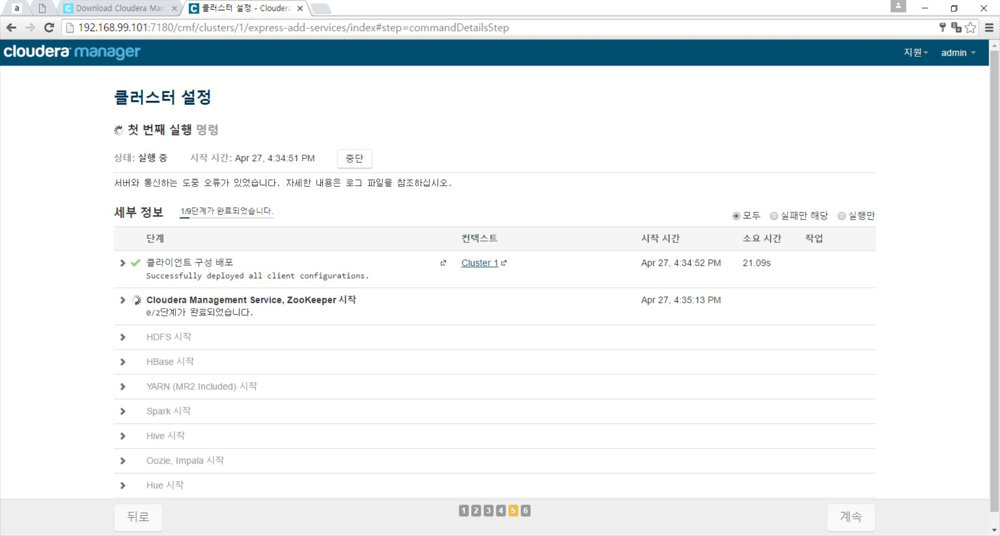

- 모든 설치가 완료가 되었다는 화면임. 완료 버튼 클릭
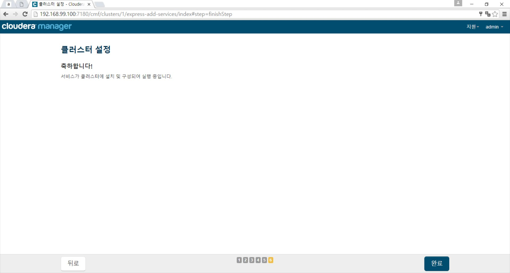

- 완료된 클라우데라 매니저 화면. 
- 더그커팅에게 감사하는 마음으로 잘 사용하자~~
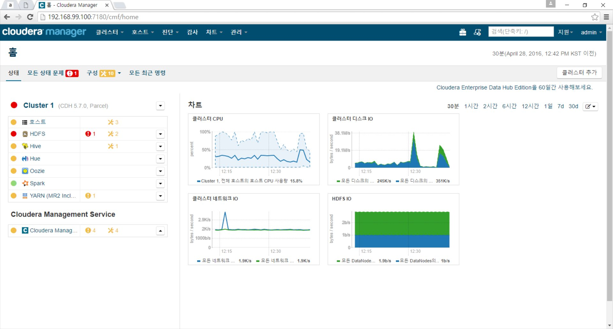


