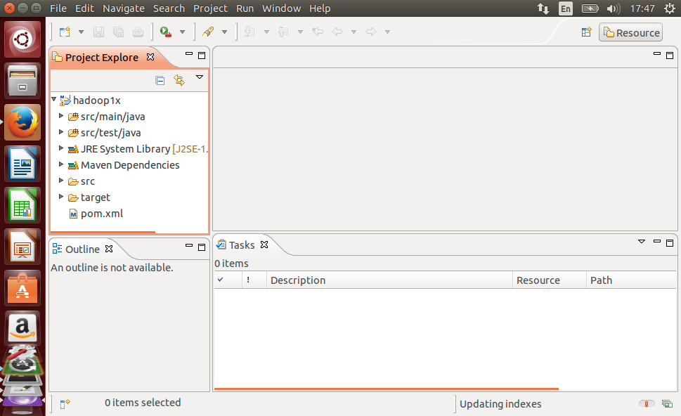

# 우분투에서 하둡 mapreduce 개발환경 만들기


## Docker에 VNC와 이클립스 설치

- 주의) 모든 환경을 설정하고 도커를 commit할때 에러가 계속 발생해서 설정이 다 날아갔음. 
- 주의) 그냥 virtualbox에서 우분투에서 하는것이 좋을것 같음.
- 주의) 용자여~~  몇시간을 낭비할 생각하고 아래와 같이 해보자..
- 주의) 운이 좋으면 잘 되겠지..~~~


- https://hub.docker.com/r/kaixhin/vnc/  이것을 이용함.
- kaixhin/vnc  Docker 이미지 설치 및 실행
- VNC의 디폴트 패스워드는 password,  변경도 가능함.
```
docker pull kaixhin/vnc
docker run -d -p 5901:5901 kaixhin/vnc
```

- TightVNC 클라이언트 설치 
```
http://www.tightvnc.com/download/2.7.10/tightvnc-2.7.10-setup-64bit.msi
```

- TightVNC 서버는 설치하지 말고 클라이언트만 설치후에 실행
- remote server : 192.168.xxx.xxx:5901

## VNC로 Docker 내부로 접속해서 설정하기
- virtualbox의 우분투에서도 이와 동일하게 설정함.
- Virtualbox에서 아래 명령어 앞에 sudo 를 붙임


- 자바, 이클립스, git, wget 설치하기
```
apt-get update -y
apt-get install wget git openjdk-7-jdk  eclipse  -y
```

- Maven 설치( 의존성 관리 및 빌드도구 )
```
cd ~/
wget  https://archive.apache.org/dist/maven/maven-3/3.2.5/binaries/apache-maven-3.2.5-bin.tar.gz
tar xvf apache-maven-3.2.5-bin.tar.gz

cat <<EOT >> ~/.bashrc
JAVA_HOME=/usr/lib/jvm/java-7-openjdk-amd64
MAVEN_HOME=`echo $HOME`/apache-maven-3.2.5

export PATH=\$JAVA_HOME/bin:\$MAVEN_HOME/bin:\$PATH
EOT

source ~/.bashrc
```

- 이클립스 최신버전 설치
- 위에서 구버전을 설치했음. maven 이클립스 플러그인 설치시에 문제 있을 경우에만 설치함.
```

cd ~/
wget http://dist.springsource.com/release/STS/3.6.4.RELEASE/dist/e4.4/groovy-grails-tool-suite-3.6.4.RELEASE-e4.4.2-linux-gtk-x86_64.tar.gz
tar xvf groovy-grails-tool-suite-3.6.4.RELEASE-e4.4.2-linux-gtk-x86_64.tar.gz

cat <<EOT >> ~/eclipse.sh
~/ggts-boundle/ggts-3.6.4.RELEASE/GGTS
EOT

chmod +x ~/eclipse.sh
```


- 예제소스 받기
```
cd ~/

git clone https://github.com/mahmoudparsian/data-algorithms-book/
```

## 이클립스 설정
- 우분투의 메뉴에 Eclipse가 등록되어 있음.
- 메뉴을 통해서 이클립스 실행
- Welcome 탭이 나오면 당황하지 말고,  Welcome탭에 있는 x 버튼을 클릭함.
### maven 이클립스 플러그인을 설치하기
    - 이클립스 -> 상단메뉴바 -> Help -> Install New Software ... 
	- Work width 입력빌드에 Indigo Update Site 라고 입력하고, 선택함.
	- Work width 입력빌드 아래에 여러 가지 목록이 나오고, 여기서 collaboration을 선택.
	- collaboration안의 여러 가지 패키지가 있고,  m2e-Maven Integration for Eclipse를 체크한 후에 Next버튼 클릭
	- 다음 화면에서 다시 Next 버튼 클릭
	- 다음 화면에서 라이센스 동의를 선택하고 Finish 버튼 클릭
	- 이클립스 restart하는 알림창이 나오면, Yes 클릭

### 하둡 MapReduce 실습용 Maven 프로젝트 생성
- 이클립스 -> 상단메뉴바 -> File -> Project...
- New Project 위자드창에서 Maven -> Maven Project 를 선택하고 Next 버튼 클릭함
- 다음화면에서  그냥 Next 버튼 클릭함
- 다음화면에서 maven-archetype-quickstart 가 선택되어 있고, 그냥 Next 버튼 클릭함
- 다음화면에서 
    - Goup id 입력필드에  org.biospin.bigbio   라고 입력
    - Arifact id 입력필드에 hadoop1x  라고 입력하고 Next 버튼 클릭함.
- 다음화면에서는 프로젝트가 만들어진 화면이 나옴.


- pom.xml 편집
    - pom.xml 더블클릭하고, 편집창에 아래에 Overview 탭으로 설정된것을  pom.xml 탭을 선택하면 텍스트들이 보여짐.
	- dependency을 추가함.
```
dependency

<dependency>
    <groupId>org.apache.hadoop</groupId>
    <artifactId>hadoop-core</artifactId>
    <version>1.2.0</version>
</dependency>


```
	


